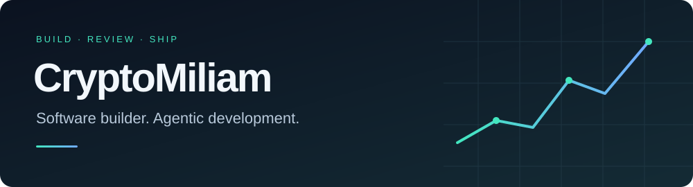
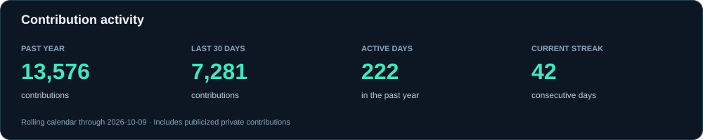
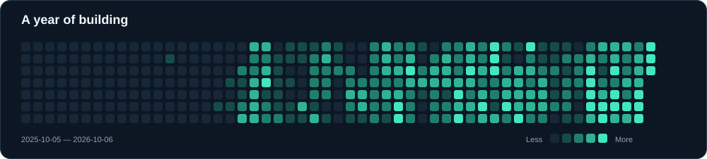

<picture>
  
</picture>

I build software with AI coding agents and the [Agentic Coding Flywheel](https://agent-flywheel.com/). Most of my product development is private. I’m opening up selected tools and experiments here.

[GitHub activity](https://github.com/CryptoMiliam#contributions) · [Public repositories](https://github.com/CryptoMiliam?tab=repositories&type=source) · [Achievements](https://github.com/CryptoMiliam?tab=achievements)

### Shipping, continuously

I use coordinated agents to turn plans into implementation, review changes with fresh eyes, and ship work in logical commits. The workflow combines task graphs, agent communication, testing, and versioned project records.

### Activity

These figures include publicly visible private contribution totals. Contributions include commits and other qualifying GitHub activity; they are not a count of features shipped. Repository names and private work details stay private.

Charts refresh daily from GitHub. Earned achievements appear in the profile sidebar.
